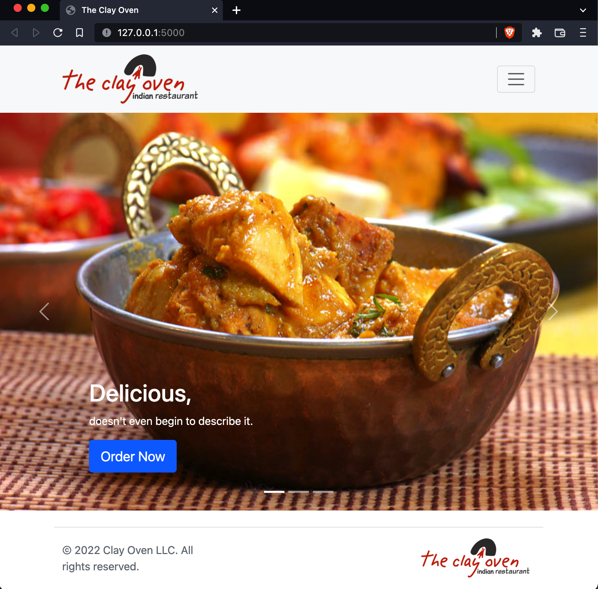
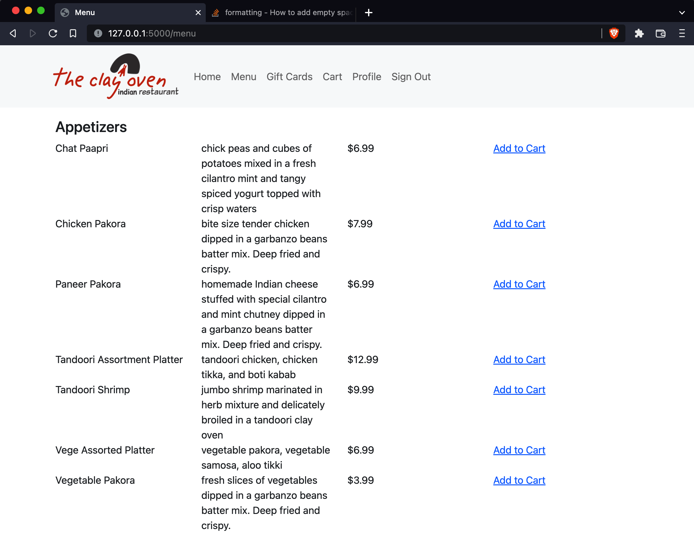
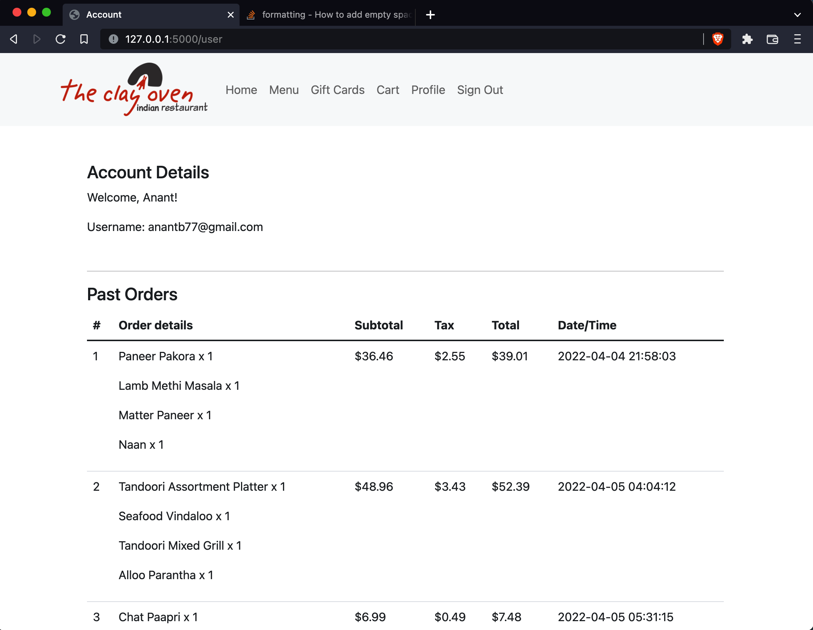
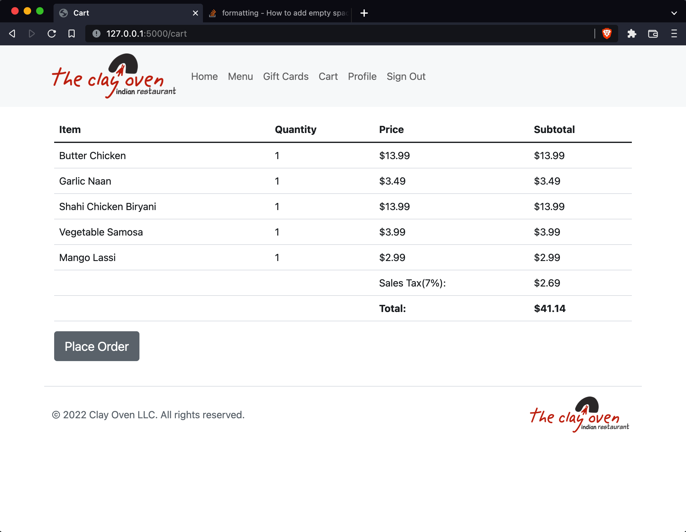

# Restaurant web app
#### Video Demo:  https://youtu.be/KrT3tUwIZCU
#### Description: Lets people view the restaurant's menu, create their account, and place psuedo orders when they sign in.

 

#### Final Project:

A restaurant website featuring a menu with 107 items that uses Flask to process requests and SQLite to store data such as users' credentials, menu items, categories, and orders.

 
Homepage

 
Menu

 
Account Page

 
Cart

---
#### Outline
- Home: Welcome screen with an image carousel
- Menu: Displays items within each category, users can place orders if they're logged in (Add to Cart link is made available once they log in)
To create the webpage I pulled in the items from clayovenindy.com via scrapy (web scraping python module), stored them in a json format and then wrote a script to populate the database using the json object as per the relationships in the database. All the files used for web scraping are included within findmenu folder.
- Gift Cards: wanted to imitate how Starbucks shows giftcards on its website
- Cart: Execute order via this page
- Profile: Welcomes the user and displays username and past orders
- Sign In/Up/Out: Create Account/Clears up session

---
#### application file
- app.py:
    - functions: takes care of all the requests and utilizing the database via index, menu, gift, signin, signup, useracc, cart, contactus, signout, error and place_order functions

---
#### database and related files
- restaurant.db - main database file
- findmenu directory consists of all the files used for web scraping the menu off the clay oven website, filter menu data, and store it into a json file
- populate_db.py file used to bring menu items from json file to the database per their categories and relationships with other tables

---
#### template files:
- cart.html: displays each item selected by the user along with its price, quantity and total including taxes until user executes the order which clears up the cart
- confirm.html: Shows a confirmation message after user clicks 'Place Order' on cart.html
- error.html: Displays error message whenever called via the error function from app.py file and takes message as an argument or if not provided then displays the default message
- giftcards.html: Shows gift cards, limited functionality
- index.html: Homepage that displays an image carousel which flips through an entree, dessert and a bread automatically and provides link to a inquiry form, create account form, and menu to place order.
- inquire.html: displays a form that takes in query from a user and their email
- layout.html: layout file that is re-used to display navbar and footer on each page
- menu.html: displays 107 items all within their respective categories, and provides user an add to cart link if they're logged in.
- signin.html: Provides user with two different forms, one to sign in or second, to sign up using their email, and by confirming password twice.
- useracc.html: This page displays username and user's past orders if any.

